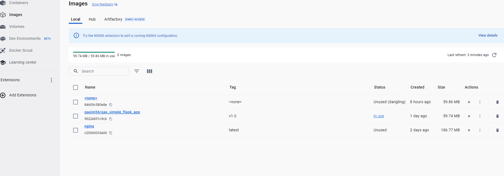
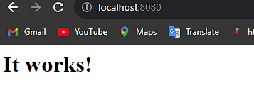
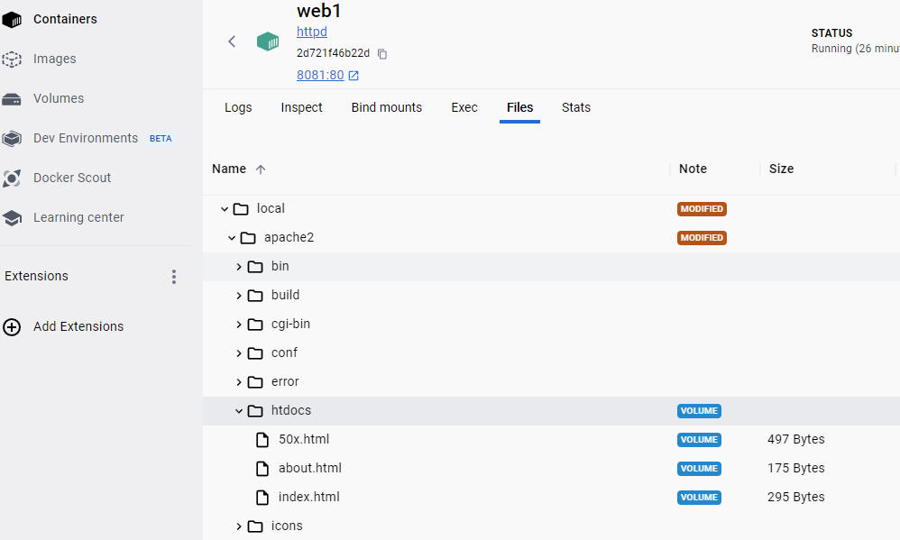

# **Part 3: Docker Volumes**

Create a new docker volume in Docker Desktop Volume tab or through following command

```
docker volume create my_volume
```

To list volumes use following command

```
docker volume ls
```

## **image**

Pull nginx image from <https://hub.docker.com/_/nginx>

Type following command in cmd

```
docker pull nginx:latest
```

Use following command to list images

```
docker images
```

You can also check a new image appears in Docker Desktop in images tab



Use following command to run the nginx image

```
docker run -it --rm -d -p 8080:80 --name web --mount source=my_volume,target=/usr/share/nginx/html nginx
```

It will display default nginx page on <http://localhost:8080/>. The - - volume will mount my_volume. The - - name will give name ‘web’ to container.

Now create a new index.html page on your local machine and copy this file to web container using following command

```
docker cp C:\Users\HH\Desktop\index.html web:/usr/share/nginx/html
```

Now again browse <http://localhost:8080/> and you will see your local machine index page on the browser


To stop container ‘web’ and remove it use following commands. It will automatically remove after stopping due –rm swich used earlier

```
docker stop web
```

# **httpd**

Pull httpd image from docker hub

```
docker pull httpd:latest
```

Check the docker image of httpd

```
docker images
```

Before running the actual command use following command without mounting the volume

```
docker run -it --rm -d -p 8081:80 --name web1 httpd
```

It will return a following page on browser **port 8081**. I have used port 8080 also for testing purpose



```
#To run a container use following command
docker run -it --rm -d -p 8081:80 --name web1 --mount source=my_volume,target=/usr/local/apache2/htdocs httpd
```

Now create a new about.html page on your local machine and copy this file to web container using following command

```
docker cp C:\Users\HH\Desktop\about.html web1:/usr/local/apache2/htdocs
```

The command will display new Html text on [**http://localhost:8081/**](http://localhost:8081/)**about.html**

To stop container ‘web’ and remove it use following commands. It will automatically remove after stopping due –rm swich used earlier

```
docker stop web1
```

# **Finding contents of Docker Volume**

There are two ways.

First way is to attach container terminal of apache to local vs terminal by following command and check the contents

```
docker exec -it web1 /bin/bash
```

Now you are in container terminal.

```
root@2d721f46b22d:/usr/local/apache2# ls
bin  build  cgi-bin  conf  error  htdocs  icons  include  logs  modules
root@2d721f46b22d:/usr/local/apache2# cd /usr/local/apache2/htdocs
root@2d721f46b22d:/usr/local/apache2/htdocs# ls
50x.html  about.html  index.html
```


Second method is check in Docker Desktop you can check both index.html and about.html are present



Stop the container and remove volume

```
docker stop web1
docker rm web1
docker volume rm my_volume
```
